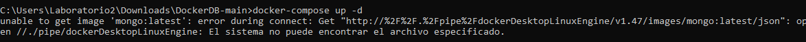
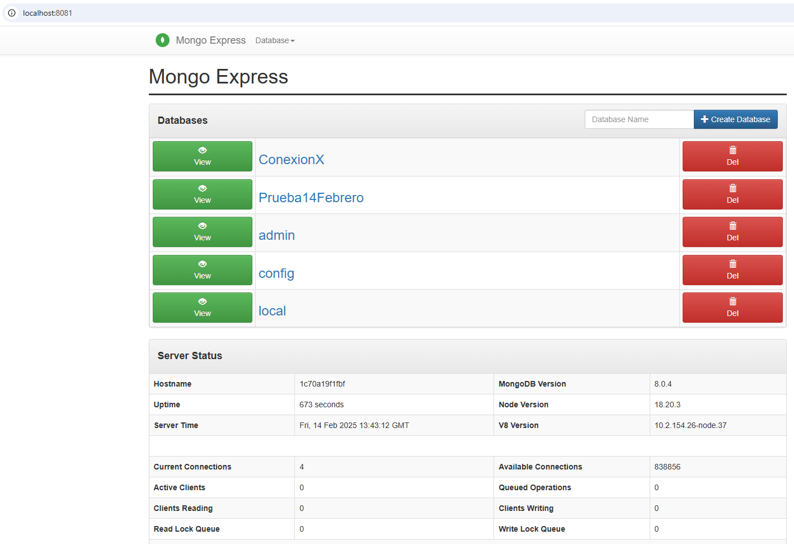

# Microevaluacion

## Equipos
Mi equipo: ConexionX y 
Equipo a evaluar: InfernoEncriptors

## Observacion 1:
Dice "Opcional puedes usar la terminal de docker para ingresar los comandos" pero no dice que es necesario tener Docker desktop abierto porque si no no funcionara el comando de "docker-compose up -d". Al abrir Docker desktop, solucione el error que me salia 

## Imagenes del DBMS funcionando correctamente

## Imagen de los contenedores funcionando 

